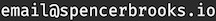

# `Spencer Brooks` `💻`

## Software Engineer

I have a passion for both front-end and back-end web development, as well as compiler/runtime engineering. I hold a BA in Mathematics and am currently pursuing an MS in Computer Science.

### Areas of Experience:

- Front-end and back-end web development
- End-to-end web application testing
- Computer Science fundamentals

### Motivation:

Driven by the challenge of turning complex problems into elegant software solutions. Currently seeking roles that focus on application software engineering, where I can leverage my skills and grow professionally.

### Projects

My projects can be found here: [Projects](/hextobin/projects)

### Contact

	© 2024 Spencer Brooks. Built with <a target="_blank" href="https://en.wikipedia.org/wiki/Markdown">Markdown</a>

